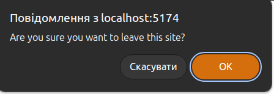

# Redirect Popup React App

This is a simple React application that demonstrates a component (`RedirectPopup`) which prompts users with a confirmation dialog before they leave the page or navigate away from a specified link.

 

## Features

- **BeforeUnload Event**: The application uses the `beforeunload` event to warn users if they attempt to refresh or close the tab.
- **Link Confirmation**: A confirmation dialog appears when users click on the link to leave the site.

## Technologies Used

- React
- JavaScript (ES6)
- CSS

## Usage

To use this application, simply run it in your local development environment. The `RedirectPopup` component will handle user prompts for navigation and page unloading.

